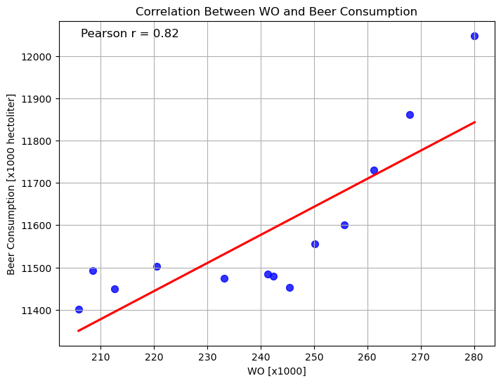

Student number: 16366557 

  - Fantastic yeasts and where to find them: the hidden diversity of dimorphic fungal pathogens 
  - An analysis of the forces required to drag sheep over various surfaces 
  - The neurocognitive effects of alcohol on adolescents and college students

Analysing this plot we can see a correlation between the the total beer consumption and the number of beers consumed by students, there exists a positive correlation between the two. A Pearson r value of $0.82$ highlights this relationship. Since our r value is close to 1 it implies a stromg linear relationship between the two. 
